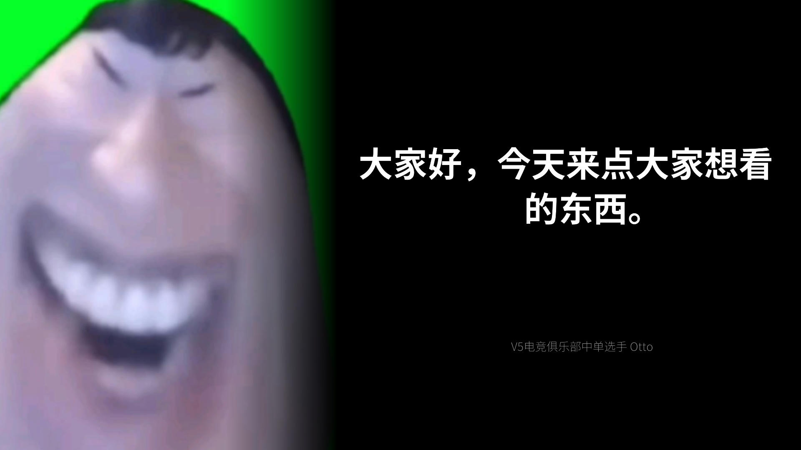

# Make quote

[](https://crates.io/crates/make-quote)
[](https://docs.rs/make-quote/)

This library provides a single function that can generate a quote image from user input.
It is still under development, further document and crates.io dependencies will be released
someday.

## Usage

```rust
use make_quote::{QuoteProducer, ImgConfig};

// First of all, load an font into memory
let font = std::fs::read("/usr/share/fonts/noto-cjk/NotoSansCJK-Regular.ttc").unwrap();

// Create a image producer
let producer = QuoteProducer::builder()
    .font(&font)
    .output_size(1920, 1080) // optional
    .font_scale(120.0)       // optional
    .build();

// Create image configuration
let config = ImgConfig::builder()
    .username("V5电竞俱乐部中单选手 Otto")
    .avatar_path("./assets/avatar.png")
    .quote("大家好，今天来点大家想看的东西。")
    .build();

// Then generate the image and get the image buffer
let buffer = producer.make_image(&config).unwrap();

// You can do anything you like to the buffer, save it or just send it through the net.
std::fs::write("./assets/test.jpg", buffer).unwrap();
```

This will provide the below example output:


